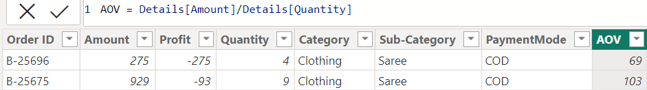
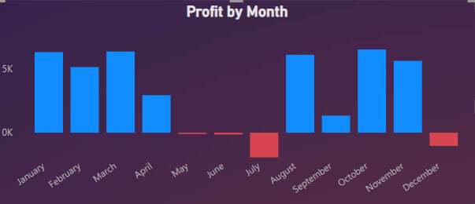
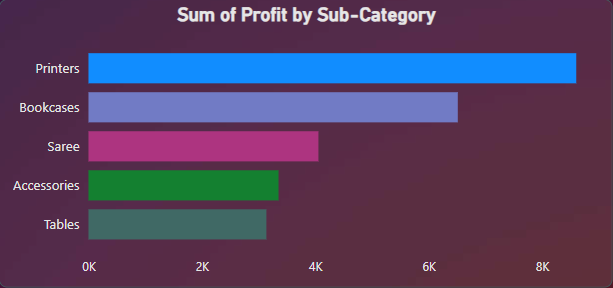
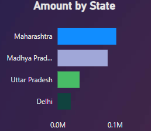
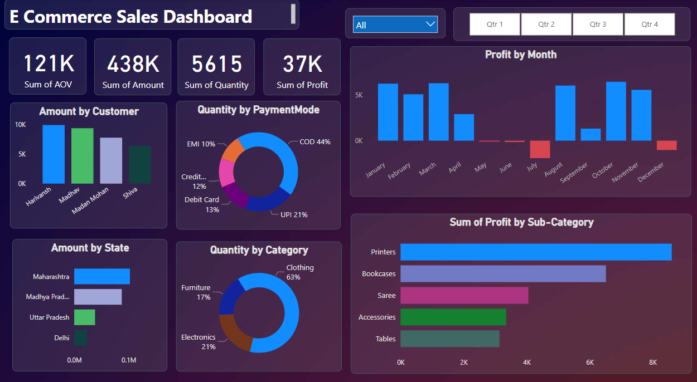

# E-commerce Sales Data Analysis: Unveiling Insights and Trends
## 1. Project Overview
- The project aims to analyze and uncover valuable insights from a dataset containing e-commerce sales data. Through a comprehensive analysis, this project explores the patterns, trends, and factors influencing sales performance in the e-commerce domain.
- By leveraging statistical analysis and exploratory data visualization the project aims to provide actionable insights to optimize business strategies and drive revenue growth. The project's focus is on understanding customer behavior and identifying key market trends to help improve decision-making processes in the e-commerce industry.
## 2. Data Source
Data used for this analysis was obtained from Kaggle. The dataset consists of two CSV files, each containing specific details related to the e-commerce orders.

1. Order Details File:
   - File Name: "Details.csv"
   - Contents: This file includes information such as order amount, quantity, date, profit, product category, and sub-category.
   - Format: CSV (Comma-Separated Values)

2. Order Summary File:
   - File Name: "Orders.csv"
   - Contents: This file provides details on individual orders, including order ID, date, customer information, state, and city.
   - Format: CSV (Comma-Separated Values)

Both files were imported into Power BI, a powerful data visualization tool, to facilitate data exploration and analysis.

  

## 3. Feature Engineering / DAX
- This dataset has a lot of numnerical columns which can be further engineered to get more insights out of it. I made a new column called Average Order Value (AOV).
- AOV is the amount of ordered things divided by the order quantity of the same product.

  

 

## 4. Exploratory Data Analysis (EDA)
- Now as the dataset is ready and loaded into model, I performed EDA to answer numerous questions which are vital to the business owner. 
- The following graphs answer these questions in very easy way so that the stakeholder can make informed decision.

### How much profit did the business earned in the last year?

  

### Ques2. Which category of products earned this business the most profit?

  

### Ques3. In which state the company sold the max amount of products?

  

## 5. Interactive dashboard
- Finally, after answering numerous questions which impact the business in a major way an interactive dashboard is made.
- The dashbaord consists of 4 KPI's , 6 charts and 2 slicers.
- By selecting any state or quarter from the slicer, the stakeholder can see how the business performed in respective categories.
- As the dashboard is interactive, it acts dynamically relating the query on one chart to all the charts in the dashboard

  

## 6. Conclusion
- This is the tip of iceberg of my skillset as data enthusiast. In this project, I tried to showcase my data analytical skills in a brief manner.
- Furthermore, I tried to showcase the calliber of PowerBI visualisation tool which helps in making interactive dashboards.
